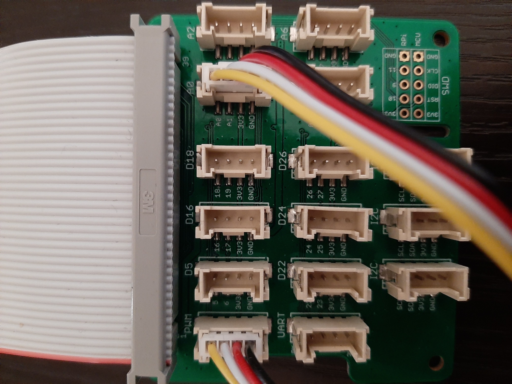
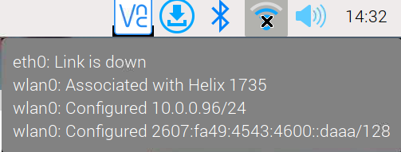

# Edge Impulse Sensor Lab
The files in this folder are a project to create samples that can be uploaded to Edge Impulse, and then run a fully trained model to identify whether or not human activity is occuring in a room using sensor data.

**What is required:**
- An Edge Impulse account and an Edge Impulse project.
- A ReTerminal Raspberry Pi, base hat, sensors and ribbon connector. Philips Screwdriver is reccomended.
- The Edge-Impulse Linux is required as well. Installation instructions can be found here: https://docs.edgeimpulse.com/docs/edge-impulse-for-linux/edge-impulse-for-linux
- The Edge-Impulse python sdk is required, tutorial to install can be found here: https://docs.edgeimpulse.com/docs/edge-impulse-for-linux/linux-python-sdk
**Note:**
The sensors that are used in this project are the built-in ReTerminal light sensor, [Grove - PIR Motion Sensor](https://wiki.seeedstudio.com/Grove-PIR_Motion_Sensor/), and [Grove - Loudness Sensor](https://wiki.seeedstudio.com/Grove-PIR_Motion_Sensor/)
## ReTerminal Setup
- Connect the Base Hat to the 40-Pin Raspberry Pi Compatible Header.
  
- Connect a motion sensor to the PWM Port on the Base Hat.
- Connect a Loudness sensor to the A0 Port on the Base Hat.


## Remotely Connecting to ReTerminal via SSH
Make sure that both the ReTerminal and your computer are on the same network (wifi or ethernet). If the ReTerminal is the only raspberry pi on the network, you can connect with the code below:
```bash
ssh username@raspberrypi.local
```
where username is the username of the account on the pi.

You may also connect to the ReTerminal using its ip address found by hovering over the network button.


It can also be found by typing:
```bash
ip addr
``` 

The ReTerminal can then be connected by typing:
```bash
ssh username@ipaddress
```
where ipaddress is the ip address of the ReTerminal.

## harvest_and_upload.sh
You can collect and upload data by running this bash file (assuming that the sensors are properly connected).
```bash
bash ./harvest_and_upload.sh < label >
```
The label must be specified as either "-p" for possible human activity or "-n" for no human activity.

This will generate 10 samples that are 10 seconds in length each in a folder caled "./samples"

You can change change the amount of samples and the length of each individual sample like so:
```bash
bash ./harvest_and_upload.sh < label > < number of samples to generate > < length of seconds >
```
Both arguments would have to be specified if you want to adjust either of them.

**Note:**
The edge-impulse-uploader can be invoked to upload many csv files at once.
```bash
edge-impulse-uploader < file path to csv folder >/*.csv
```
Make sure that the csv files follow the edge-impulse convention described here:
https://docs.edgeimpulse.com/reference/data-ingestion/importing-csv-data

## Training the model
After the data is collected and uploaded to Edge Impulse: the model can then be trained using the Edge Impulse interface.

Help for model training on Edge Impulse can be found here: https://docs.edgeimpulse.com/docs

You can then download the model binary file by executing the code below:
```bash
edge-impulse-runner --download < insert name here >.eim
```

## classify.py
After acquiring the model, you can then run the classify.py script.

Remember to specify a path like so:
```bash
python ./classify.py < path to model >.eim
```
and to make sure that the sensors are properly connected to the ReTerminal.


